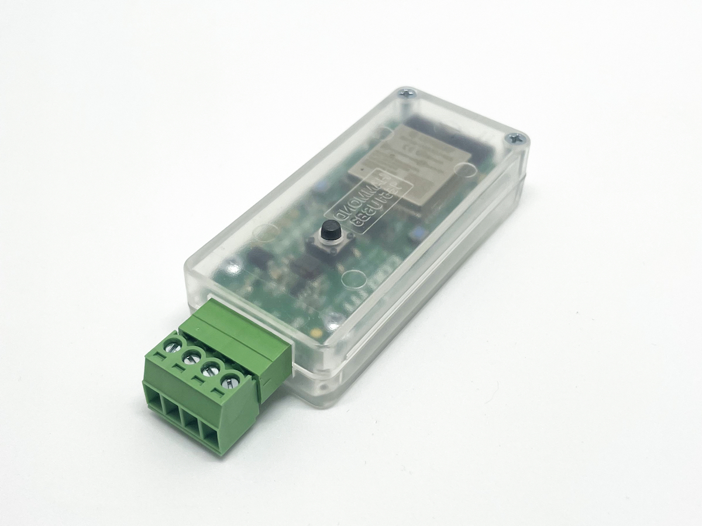

# Wi-Fi Pixel Controller

ESP32 based Wi-Fi Pixel Controller to drive adressable LED strips like Neopixel/WS281x/SK6812/WS2801/WS2815/etc using [WLED](https://github.com/Aircoookie/WLED).
Version 0.8 now can be used with 5V *and* 12V strips without the need of external dc-dc converters and we've updated the microcontroller from an ESP8266 to an ESP32. Therefore handling of more LED's and multiple strips are no problem. See https://kno.wled.ge/features/multi-strip/

There now is a button (`IO15`) which can be freely confirugred via WLED. See https://kno.wled.ge/features/macros/#buttons Theoreticly you can also use the flash button on the PCB as an input (`IO0`).

As of WLED 0.13 the first button can be used to do a factory reset by holding it for longer than ten seconds.

* [Wiring Example WS281x/SK6812 5V/12V](https://shop.codm.de/media/pdf/53/e0/3b/Anschlussplan-codm-pixel-controller-V0-8-WS281x-SK6812-1-0.pdf)
* [Wiring Example WS2801/APA102 5V/12V](https://shop.codm.de/media/pdf/81/70/48/Anschlussplan-codm-pixel-controller-V0-8-WS2801-1-0.pdf)
* [Wiring Example WS2815 12V](https://shop.codm.de/media/pdf/1b/ac/0b/Anschlussplan-codm-pixel-controller-V0-8-WS2815-1-0.pdf)

You can buy it at our webshop: [Wi-Fi Pixel Controller (WLED)](https://shop.codm.de/automation/pixel/30/wlan-pixel-controller-wled)

The board comes preflashed with the current version of WLED, but can be used with any firmware you like, as we've added a flash and reset button for easy flashing.

It can be used with nearly every type of adressable led strips: WS2812B, WS2813, SK6812, APA102, WS2801, LPD8806, TM1814, WS2811, WS2815, GS8208.

Please read the [Adafruit Neopixel Uberguide](https://learn.adafruit.com/adafruit-neopixel-uberguide) on how to work with Neopixels. Antother good starting pint is the [WLED documentation](https://kno.wled.ge/).

Based on the LoxPixel-idea from Dennis (www.unser-smartes-zuhause.de) we've discussed a board layout and in the beginning developed our own software based in Dennis' initial code.
In the end we've settled to expand the absolutely astonishing WLED project with the needed features for Loxone. In Version 0.11 WLED can now understand Loxone values.

## Features

* Espressif ESP32-WROOM-32E 4MB
* usable in 5V and 12V installations
* up to four lanes of pixel
* drives up to 1000 pixel per lane
* more ESP32 pins are accesible on the back of the PCB
* compact (72x30x16mm)
* reverse polarity protection
* wiring through srew-plug terminal
* real 74AHCT125D level shifter
* detailed instructions
* could be easily (re-)programmed
* open source (CC-BY-NC-SA 4.0)

# Thanks

* [Aircookie](https://github.com/Aircoookie) and the folks from [WLED](https://github.com/Aircoookie/WLED)
* Dennis Henning for the inital idea of the [Lox!Pixel](https://unser-smartes-zuhause.de/2019/10/20/loxpixel-rgbw-neopixel-integration-in-loxone/)
* [m0fa](https://github.com/m0fa)

# License

[CC-BY-NC-SA 4.0](https://creativecommons.org/licenses/by-nc-sa/4.0/de/)

cod.m GmbH, Patrik Mayer, 2022