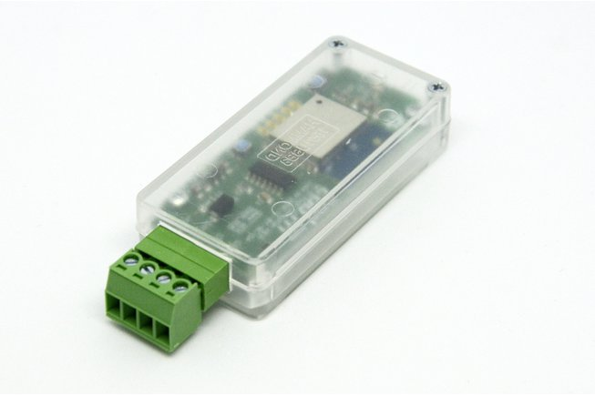

# Wi-Fi Pixel Controller

ESP8266 based Wi-Fi Pixel Controller to drive adressable LED stripes like Neopixel/SK6812/WS2801/etc using [WLED](https://github.com/Aircoookie/WLED).
Version 0.6 includes an 74AHCT125D level shifter for the 5V logic of the typical pixel. 12V stripes could also be used, as they too have 5V data lines. See the wiring examples:

* [Wiring Example WS281x/SK6812](https://shop.codm.de/media/pdf/c6/80/6c/Anschlussplan-cod-m-PixelController-0-6-WS2812-SK6812.pdf)
* [Wiring Example WS281x/SK6812 12V](https://shop.codm.de/media/pdf/g0/b8/fe/Anschlussplan-cod-m-PixelController-0-6-WS2812-SK6812-12V.pdf)
* [Wiring Example WS2801/APA102](https://shop.codm.de/media/pdf/4b/d0/af/Anschlussplan-cod-m-PixelController-0-6-WS2801-APA102.pdf)

You can buy it at our webshop: [Wi-Fi Pixel Controller (WLED)](https://shop.codm.de/automation/pixel/30/wlan-pixel-controller-wled)

The board comes preflashed with the current version of WLED, but can be used with any firmware you like, as we've added a flash and reset button for easy flashing.

It can be used with nearly every type of adressable led strips: WS2812B, WS2813, SK6812, APA102, WS2801, LPD8806, TM1814, WS2811, WS2815, GS8208.

Please read the [Adafruit Neopixel Uberguide](https://learn.adafruit.com/adafruit-neopixel-uberguide) on how to work with Neopixels. Antother good starting pint is the [WLED Wiki](https://github.com/Aircoookie/WLED/wiki).

Based on the LoxPixel-idea from Dennis (www.unser-smartes-zuhause.de) we've discussed a board layout and in the beginning developed our own software based in Dennis' initial code.
In the end we've settled to expand the absolutely astonishing WLED project with the needed features for Loxone. In Version 0.11 WLED can now understand Loxone values.

* compact (72x30x16mm)
* reverse polarity protection
* wiring through srew-plug terminal
* open source, using ESP-WROOM-02D 4MB
* real 74AHCT125D level shifter
* drives up to 850 pixel
* detailed instructions
* could be easily (re-)programmed

# Thanks
* [Aircookie](https://github.com/Aircoookie) and the folks from [WLED](https://github.com/Aircoookie/WLED)
* Dennis Henning for the inital idea of the [Lox!Pixel](https://unser-smartes-zuhause.de/2019/10/20/loxpixel-rgbw-neopixel-integration-in-loxone/)
* [m0fa](https://github.com/m0fa)

# License
[CC-BY-NC-SA 3.0](https://creativecommons.org/licenses/by-nc-sa/3.0/de/)

cod.m GmbH, Patrik Mayer, 2020